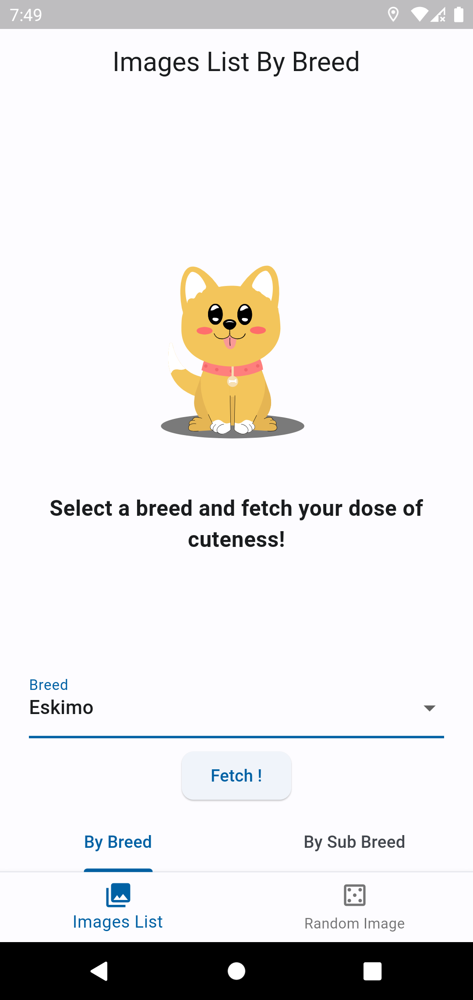
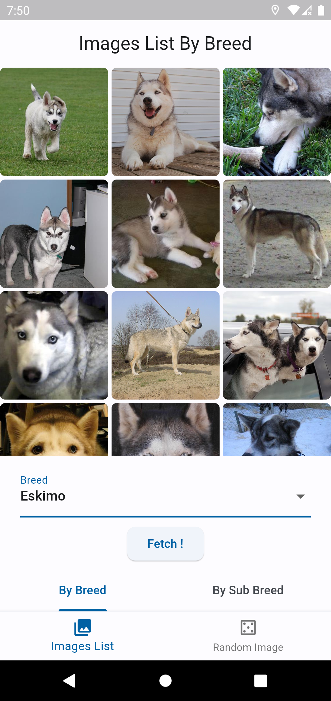
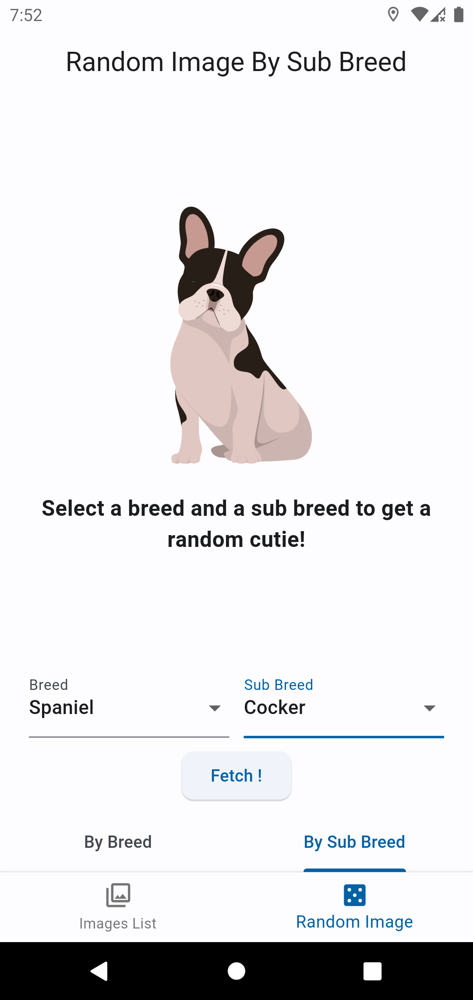
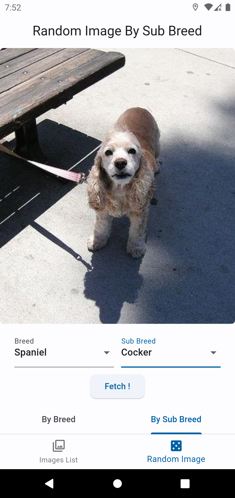

# Dog Board - Flutter App

## Overview

“Dog Board” is a mobile application where you can find plenty of cute dog pictures. Besides its cuteness, the app was developed with Test Driven Development, considering the Clean Architecture, and best practices were diligently utilized.

**Functionality:**

Dog Board simply allows you to view images by selecting a breed or both breed and sub-breed. Just select the desired breed and sub-breed, press the button, and once the pictures are loaded, you can click on an image to zoom in and out to get your daily dose of cuteness.

**Logic:**

When the application is first launched, the breeds are fetched from the service and cached for 2 hours. Within this period, even if the user closes and reopens the application, the breeds come from the cache. The breed information fetched after the application is opened is kept in a singleton bloc state. In this way, the breed data, which is commonly needed in every feature and which we don't expect to change frequently, is used without constantly fetching it.

**Tests:**

In the project, a total of 83 unit and widget tests were written, achieving a code coverage rate of over 73%.

  

  

## Architecture

The app is built following the principles of Clean Architecture, ensuring separation of concerns, testability, and maintainability. It employs a wide array of packages to achieve this robust architecture:

- **State Management:** `bloc`, `flutter_bloc`
- **Routing:** `auto_route`
- **Networking:** `dio`, `retrofit`
- **Dependency Injection:** `get_it`
- **Storage:** `hive`, `hive_flutter`,`path_provider`
- **Functional Programming:** `dartz`
- **Utilities:** `cached_network_image`,`bloc_concurrency`, `equatable`, `json_annotation`, `json_serializable`
- **UI:** `cached_network_image`,`shimmer`, `lottie`
- **Testing:** `bloc_test`, `flutter_test`, `mocktail`
- **Code Generation:** `build_runner`, `retrofit_generator`, `auto_route_generator`

...among others. For a complete list, refer to the `pubspec.yaml`.

## File Structure

```
.
├── app
├── core
│   ├── app_router
│   ├── app_theme
│   ├── error
│   ├── extension
│   ├── mapper
│   ├── resources
│   └── use_case
├── data
│   ├── client
│   ├── data_source
│   ├── local_storage
│   │   └── hive_adapters
│   ├── model
│   │   └── base
│   └── repository
├── domain
│   ├── entity
│   ├── mapper
│   ├── repository
│   └── use_case
├── features
│   ├── dashboard
│   │   └── presentation
│   │       ├── bloc
│   │       └── page
│   ├── image_full_screen
│   │   └── presentation
│   │       └── page
│   ├── images_list
│   │   └── presentation
│   │       ├── images_list
│   │       │   └── page
│   │       ├── images_list_by_breed
│   │       │   ├── bloc
│   │       │   └── page
│   │       └── images_list_by_sub_breed
│   │           ├── bloc
│   │           └── page
│   └── random_image
│       └── presentation
│           ├── random_image
│           │   └── page
│           ├── random_image_by_breed
│           │   ├── bloc
│           │   └── page
│           └── random_image_by_sub_breed
│               ├── bloc
│               └── page
└── presentation
    └── widgets
```

## Run The Project

### Prerequisites
- Flutter SDK version '>=3.1.4 <4.0.0'
  
### Setup and Run

1. **Clone the repository:**

```
$ git clone https://github.com/furkansoylemez/dog_board.git
```

2. **Navigate to the project directory:**

```
$ cd dog_board
```

3. **Install dependencies:**

```
$ flutter pub get
```

4. **Run the app:**

```
$ flutter run
```